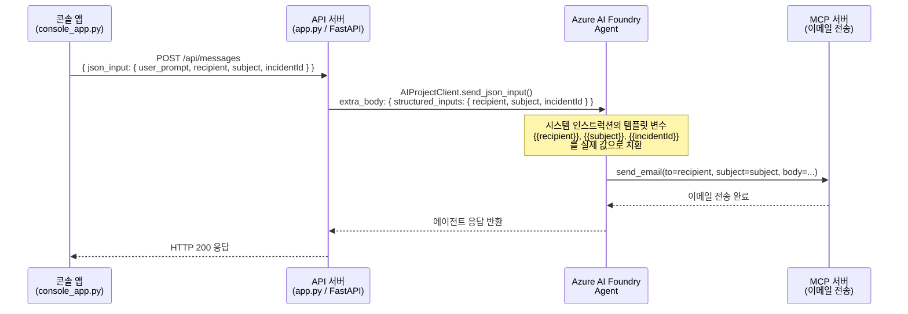
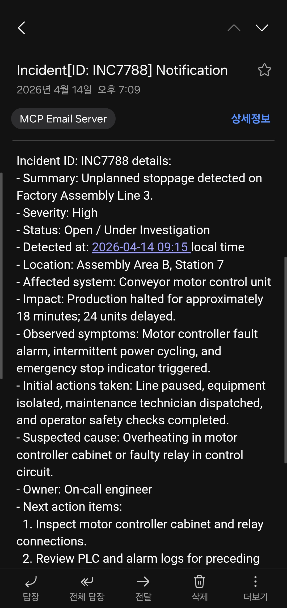

# Azure AI Foundry Agent — Structured Input 데모

> **Microsoft Azure AI Foundry Agent**의 **Structured Input** 기능을 시연하는 Python 데모 프로젝트입니다.  
> 클라이언트가 JSON POST body에 구조화된 입력을 담아 API 서버로 전달하면, 에이전트가 이를 시스템 인스트럭션의 템플릿 변수로 활용하여 MCP 서버의 이메일 전송 툴을 자동으로 호출합니다.

---

## 목차

1. [시작하기 (환경 설정)](#chapter-1-시작하기-환경-설정)
2. [아키텍처](#chapter-2-아키텍처)
3. [환경 변수 설정](#chapter-3-환경-변수-설정)
4. [실행 방법](#chapter-4-실행-방법)

---

## Chapter 1. 시작하기 (환경 설정)

### 1-1. 저장소 클론

```bash
git clone git@github.com:bedro96/Structured_input.git
cd Structured_input
```

### 1-2. uv 설치

이 프로젝트는 고속 Python 패키지 관리자인 **[uv](https://docs.astral.sh/uv/)** 를 사용합니다.

```bash
# pip으로 설치 (간단)
pip install uv

# 또는 공식 설치 스크립트 (Linux/macOS)
curl -LsSf https://astral.sh/uv/install.sh | sh
```

### 1-3. 가상환경 생성

```bash
uv venv .venv
```

### 1-4. 가상환경 활성화

```bash
source .venv/bin/activate
```

### 1-5. 의존성 설치

```bash
uv sync
```

`pyproject.toml`에 정의된 모든 의존성이 격리된 가상환경에 설치됩니다.

### 1-6. 환경 변수 설정

```bash
cp .env.example .env
# .env 파일을 열어 Azure AI Foundry 자격증명을 입력하세요
```

> **💡 참고**: 에이전트를 미리 생성할 필요가 없습니다.  
> `.env`에 에이전트 이름(`AZURE_AI_AGENT_NAME`)으로 해당 이름의 에이전트가 Foundry 프로젝트에 존재하지 않으면 **앱 실행 시 자동으로 에이전트가 생성**됩니다.

### 1-7. Azure 로그인

```bash
az login --use-device-code
```

인증은 통상 **Azure Entra ID**의 `DefaultAzureCredential`을 사용합니다. 이 코드에서는 `AzureCliCredential` 되어 있어서 로그인된 사용자의 Credential을 사용하게 됩니다. 

---

## Chapter 2. 아키텍처

### 전체 흐름 다이어그램



---

### 핵심 강조 1 — 클라이언트의 구조화된 입력 전달

클라이언트(`console_app.py`)는 다음과 같은 JSON POST body를 API 서버로 전송합니다.

```json
{
  "json_input": {
    "user_prompt": "Notify the on-call engineer about incident INC7788 via email.",
    "recipient": "kunhoko@kakao.com",
    "subject": "Incident[ID: INC7788] Notification",
    "incidentId": "INC7788"
  }
}
```

API 서버(`app.py`)는 이를 받아 `client.py`의 `send_json_input()` 메서드를 호출하면서 `extra_body`에 `structured_inputs`를 포함하여 Foundry 에이전트로 전달합니다.

```python
# client.py — send_json_input()
create_kwargs = {
    "conversation": conversation_id,
    "input": json_input.get("user_prompt", ""),
    "extra_body": {
        "agent_reference": {"name": self._agent_name, "type": "agent_reference"},
        "structured_inputs": {
            "recipient": json_input.get("recipient"),
            "subject":   json_input.get("subject"),
            "incidentId": json_input.get("incidentId"),
        },
    },
}
```

---

### 핵심 강조 2 — 시스템 인스트럭션의 템플릿 변수

에이전트의 **시스템 인스트럭션**에는 아래와 같이 이중 중괄호(`{{ }}`)로 감싼 템플릿 변수가 포함됩니다.  
Foundry가 런타임에 `structured_inputs` 값을 이 자리에 자동으로 채워 넣어 LLM에 전달합니다.

```
"{{recipient}} is email recipient for MCP server"
"{{subject}} is email subject for MCP server"
"{{incidentId}} is incident ID to compose email body."
```

---

### 핵심 강조 3 — 에이전트 정의의 `structured_inputs` 선언

에이전트를 생성할 때 `PromptAgentDefinition`에 `structured_inputs` 필드를 반드시 선언해야 합니다.  
각 입력 변수는 `StructuredInputDefinition`으로 타입과 필수 여부를 명시합니다.

```python
# client.py — create_agent()
structured_inputs={
    "recipient": StructuredInputDefinition(
        description="이메일 수신자 주소",
        required=True,
        schema={"type": "string"},
    ),
    "subject": StructuredInputDefinition(
        description="이메일 제목",
        required=True,
        schema={"type": "string"},
    ),
    "incidentId": StructuredInputDefinition(
        description="분석할 사건 ID",
        required=True,
        schema={"type": "string"},
    ),
},
```

---

### 결과 — LLM이 인스트럭션을 준수하여 이메일 전송

위의 흐름이 정상적으로 완료되면, 에이전트는 MCP 서버의 이메일 전송 툴을 호출하여 지정된 수신자에게 인시던트 알림 이메일을 전송합니다.



---

### 소스 파일 구조

```
.
├── .env.example          # 환경 변수 템플릿
├── .python-version       # Python 3.13 버전 고정 (uv)
├── pyproject.toml        # 프로젝트 메타데이터 및 의존성 (uv)
├── README.md
└── src/
    ├── agent/
    │   └── client.py     # Azure AI Foundry 에이전트 클라이언트 (AIProjectClient 래퍼)
    ├── api/
    │   └── app.py        # FastAPI REST API 서버
    ├── skills/
    │   ├── __init__.py                 # 패키지 공개 인터페이스
    │   └── foundry_agent_skill.py     # FoundryAgentSkill — 에이전트를 SKILL로 래핑
    └── console_app.py    # 콘솔 데모 앱 (API 서버에 HTTP POST 전송)
```

---

## Chapter 5. FoundryAgentSkill — SKILL 사용법

`FoundryAgentSkill`은 `FoundryAgentClient` 클래스를 AI 파이프라인에서 **재사용 가능한 스킬(Skill)** 로 노출하는 래퍼입니다.  
Semantic Kernel, AutoGen, LangChain 등 어떤 오케스트레이터에서도 도구(Tool) 또는 스킬로 등록할 수 있습니다.

### 5-1. SKILL 구성 요소

| 구성 요소 | 설명 |
|---|---|
| `SkillInput` | 스킬 입력 스키마 (Pydantic). `user_prompt`, `recipient`, `subject`, `incidentId`, `conversation_id` 포함 |
| `SkillOutput` | 스킬 출력 스키마 (Pydantic). `output`(에이전트 응답), `conversation_id`, `skill_name` 포함 |
| `@skill_function` | 함수에 이름·설명·입출력 메타데이터를 부착하는 데코레이터 |
| `FoundryAgentSkill` | 스킬 클래스 — `run()` 단일 진입점으로 에이전트 생명주기, 대화 관리, 구조화된 입력 전송을 처리 |

### 5-2. 기본 사용법

```python
from src.skills import FoundryAgentSkill, SkillInput

skill = FoundryAgentSkill()
payload = SkillInput(
    user_prompt="Notify the on-call engineer about INC0042 via email.",
    recipient="oncall@example.com",
    subject="Incident[ID: INC0042] Notification",
    incident_id="INC0042",      # 또는 alias: incidentId="INC0042"
)
result = skill.run(payload)
print(result.output)            # 에이전트의 최종 텍스트 응답
print(result.conversation_id)  # 다음 턴에 재사용할 대화 ID
```

### 5-3. 컨텍스트 매니저 사용 (리소스 자동 정리)

```python
from src.skills import FoundryAgentSkill, SkillInput

with FoundryAgentSkill() as skill:
    result = skill.run(SkillInput(
        user_prompt="...",
        recipient="oncall@example.com",
        subject="Incident[ID: INC0042] Notification",
        incident_id="INC0042",
    ))
    print(result.output)
# __exit__ 시 AIProjectClient 및 Credential 리소스 자동 해제
```

### 5-4. 다중 턴(Multi-turn) 대화

```python
from src.skills import FoundryAgentSkill, SkillInput

with FoundryAgentSkill() as skill:
    # 첫 번째 턴
    r1 = skill.run(SkillInput(
        user_prompt="INC0042 알림 이메일을 보내줘.",
        recipient="oncall@example.com",
        subject="Incident[ID: INC0042] Notification",
        incident_id="INC0042",
    ))
    # 두 번째 턴 — 같은 대화 이어가기
    r2 = skill.run(SkillInput(
        user_prompt="방금 보낸 이메일 내용을 요약해줘.",
        recipient="oncall@example.com",
        subject="Incident[ID: INC0042] Notification",
        incident_id="INC0042",
        conversation_id=r1.conversation_id,   # 이전 대화 ID 전달
    ))
    print(r2.output)
```

### 5-5. 스킬 메타데이터 조회

```python
from src.skills import FoundryAgentSkill
import json

skill = FoundryAgentSkill()
metadata = skill.get_skill_metadata()
print(json.dumps(metadata, indent=2, ensure_ascii=False, default=str))
```

출력 예시:

```json
{
  "name": "FoundryAgentSkill",
  "version": "1.0.0",
  "description": "Azure AI Foundry 에이전트를 통해 구조화된 입력(수신자·제목·인시던트 ID)을 받아 MCP 서버를 호출하여 인시던트 알림 이메일을 전송하는 스킬.",
  "input_schema": { ... },
  "output_schema": { ... }
}
```

### 5-6. 독립 실행 데모

```bash
uv run skills-demo
```

API 서버를 구동하지 않고 **FoundryAgentSkill을 직접** 호출하는 end-to-end 데모입니다.  
MCP 서버와 `.env` 파일이 준비된 환경에서 실행하세요.

---

## Chapter 3. 환경 변수 설정

`.env.example`을 복사하여 `.env`를 생성한 뒤, 아래 표를 참고하여 값을 입력하세요. 또는 제 휴대폰번호를 아시면 - 제외하고 번호로만 env.zip을 푸세요.

```bash
sudo apt update
sudo apt install p7zip-full
7z x env.zip
비밀번호 입력
````

| 환경 변수 | 예시 값 | 설명 |
|---|---|---|
| `AZURE_AI_PROJECT_ENDPOINT` | `https://<your-ai-services-account>.services.ai.azure.com/api/projects/<your-project-name>` | Azure AI Foundry 프로젝트 엔드포인트 URL |
| `AZURE_AI_MODEL_DEPLOYMENT_NAME` | `gpt-4o` | 사용할 AI 모델의 배포 이름 |
| `AZURE_AI_AGENT_NAME` | `agent-name-01` | 에이전트 이름 (없으면 자동 생성) |
| `API_HOST` | `localhost` | API 서버가 바인딩할 호스트 |
| `API_PORT` | `8080` | API 서버가 수신할 포트 |
| `LOG_LEVEL` | `DEBUG` | 로그 출력 레벨 (`DEBUG` / `INFO` / `WARNING` / `ERROR`) |
| `MCP_SERVER_LABEL` | `Description_for_this_email_MCP_Server` | MCP 서버에 대한 설명 레이블 |
| `MCP_SERVER_URL` | `http://127.0.0.1/mcp` | MCP 서버의 엔드포인트 URL |
| `MCP_REQUIRE_APPROVAL` | `never` | 툴 호출 승인 정책 (`never` = 자동 승인) |
| `MCP_SERVER_CONNECTION_NAME` | `<your-mcp-connection-name>_mcp` | Foundry 프로젝트에 등록된 MCP 서버 연결 이름 |

---

## Chapter 4. 실행 방법

두 개의 터미널을 열어 아래 순서대로 실행하세요.

### Terminal 1 — API 서버 실행

```bash
uv run api-server
```

- **역할**: FastAPI 기반 REST API 서버를 시작합니다.
- 기본 주소: `http://localhost:8080`
- 인터랙티브 API 문서: `http://localhost:8080/docs`
- 클라이언트(콘솔 앱)로부터 POST 요청을 받아 Azure AI Foundry 에이전트와 통신합니다.
- 에이전트가 존재하지 않으면 **서버 시작 시 자동으로 생성**합니다.

**예상 출력:**

```
INFO:     Uvicorn running on http://localhost:8080 (Press CTRL+C to quit)
INFO:     Agent 'agent-name-01' found. Skipping creation.
INFO:     Application startup complete.
```

---

### Terminal 2 — 콘솔 앱 실행

```bash
uv run console-app
```

- **역할**: API 서버에 HTTP POST 요청을 전송하는 데모 클라이언트입니다.
- `user_prompt`, `recipient`, `subject`, `incidentId`가 담긴 JSON body를 API 서버로 전송합니다.
- API 서버 → Foundry 에이전트 → MCP 이메일 툴 호출의 전체 흐름을 실행합니다.
- 에이전트의 최종 응답을 콘솔에 출력합니다.

**예상 출력:**

```
[POST] http://localhost:8080/api/conversations
[INFO] Conversation created: conv_xxxxxxxx
[POST] http://localhost:8080/api/conversations/conv_xxxxxxxx/messages
[INFO] Agent response: 이메일이 성공적으로 전송되었습니다. 수신자: kunhoko@kakao.com
```
